<!-- _class: lead -->
<!-- _paginate: false -->

# 제논라이프 AI 상담 포털
## 기능 소개 — 상담사 · 관리자

콜센터 상담 지원 · VoC 통합 관리 · 상담 품질 검수 · 대외민원 대응

*AICC Demo · Next.js 14*

---

## 포털 개요 — 역할별 핵심 메뉴

로그인 시 계정 유형(`상담사 gena.kim` / `관리자 park.admin`)을 선택하면 사이드바 상단 메뉴가 분기됩니다.

| | 상담사 (Agent) | 관리자 (Admin) |
|---|---|---|
| **1** | AI 상담 홈 (실시간 콜 허브) | AI 상담 홈 — 운영 대시보드 |
| **2** | 실시간 고객 상담 | 실시간 상담 모니터링 |
| **3** | 상담 이력 조회 | 상담 품질 검수 |
| **4** | 후속업무 — 접촉 이력 등록 | VoC 애널리틱스 (실시간·통계·리포트) |
| **5** | 후속업무 — SMS 발송 | 민원 탐지·이관 |
| **6** | 후속업무 — 상담 검수 결과 | 대외민원 처리 |

상담사는 "상담 → 후처리 → 검수" 현장 업무, 관리자는 "운영 관제 → 품질 검수 → VoC·민원 대응"을 담당합니다.

---

<!-- _class: lead -->
# Ⅰ. 상담사 (Agent) 화면

---

## [상담사] ① AI 상담 홈

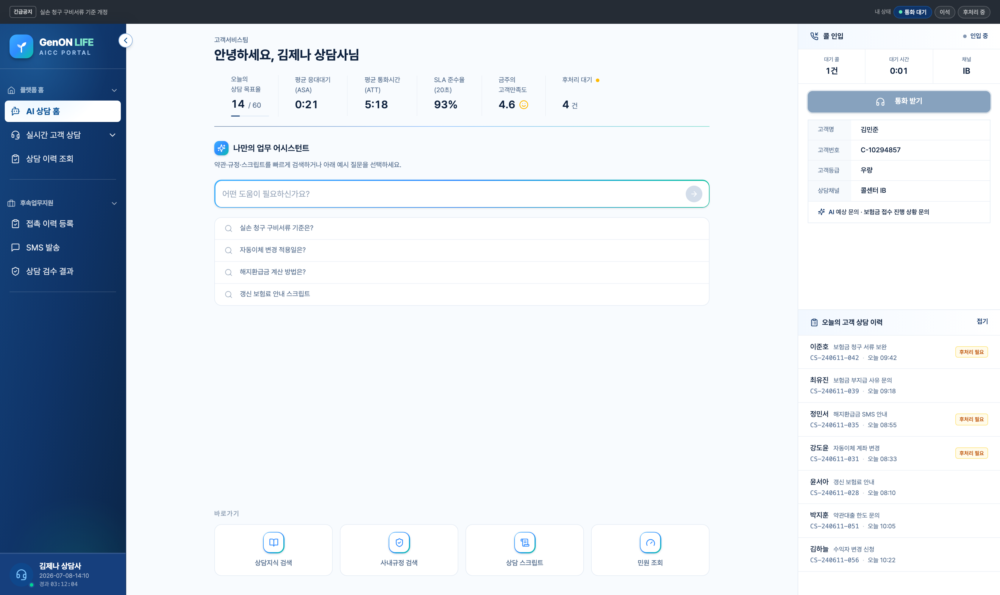

/main · agent 근무 시작 시점의 **실시간 콜 수신 대기 + 업무 지원 허브**. 좌측 작업 존 / 우측 실시간 콜 패널.

### 오늘의 상담 KPI (상단 바)
- 상담 목표율 **14/60** · 평균 응대대기(ASA) **0:21** · 평균 통화 **5:18** · SLA 준수율 **93%** · 금주 만족도 **4.6** · 후처리 대기 건수.

### 나만의 업무 어시스턴트 (AI 검색·채팅형)
- 약관·규정·스크립트 자연어 검색 → 요약 답변.
- **근거 태그**(실손 특약 약관 §7 등) 클릭 → 원문 팝업.

### 우측 실시간 콜 패널
- **콜 인입** 자동 감지 → 고객 정보 조회(김민준·우량)·**AI 예상 문의** 표시 → "통화 받기".
- **오늘의 고객 상담 이력** — 클릭 시 후처리로 이동.

---

## [상담사] ② 실시간 고객 상담

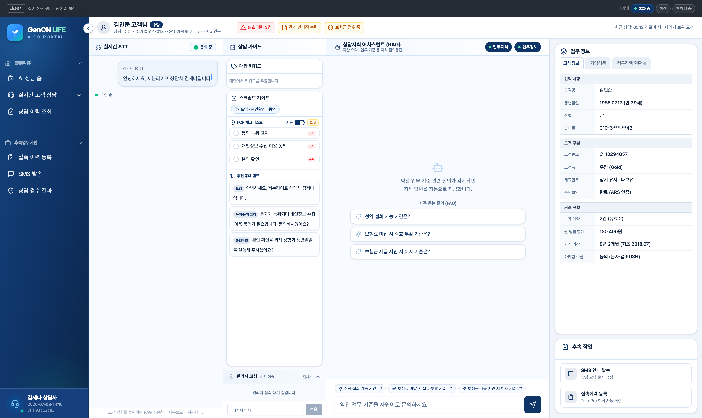

/insight-chat · counseling 통화 수신 후 상담사를 **실시간 보조하는 AI 상담 워크스페이스**. 데모 케이스 **김민준**으로 시연.

### 상담 가이드 (좌측)
- **대화 키워드** 실시간 추출 · **스크립트 가이드**(도입·본인확인·동의).
- **FCR 체크리스트** — 통화 녹취 고지·개인정보 동의·본인 확인 자동 체크 · **추천 응대 멘트**.

### 상담지식 어시스턴트 (RAG · 우측)
- 예시 칩·직접 질문 → **약관·업무기준 근거와 함께 답변**. 관련 지식 자동 제시(FAQ).

### 관리자 실시간 코칭
- 상단 고객 배지(실효이력 3건·보험금 접수 중) · 관리자 코칭 메시지 실시간 수신.

---

## [상담사] ③ 상담 이력 조회

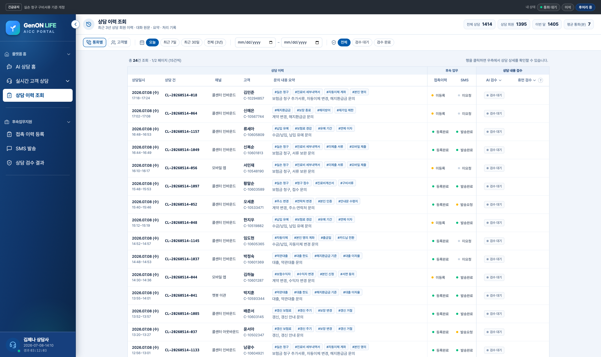

/post-consultation 상담 이력을 기간·상태별로 검색·조회. 상담사는 **본인 상담(김제나)** 기준.

### 필터 바
- **보기**: 통화별 / 상담사별 / 고객별 · **기간**: 오늘 / 7일 / 30일 / 지정.
- **AI 검수 · 휴먼 검수** 상태 열 드롭다운 필터.

### 이력 테이블
- 상담 ID(`CL-20260514-042`) · 고객 · 상담시간 · 채널(콜센터 IB·아웃바운드·챗봇 이관) · 주제 · 검수 상태.
- **후속업무 열** — 접촉이력(등록완료 / **미등록**) · SMS(발송완료 / **발송요청** / 미요청). 미처리는 **노란 닷**, 클릭 시 처리 화면 이동.

오늘 데모: 접촉 미등록 5건 · SMS 미발송 3건이 후속업무와 연동.

---

## [상담사] ④ 후속업무지원 (메일함형)

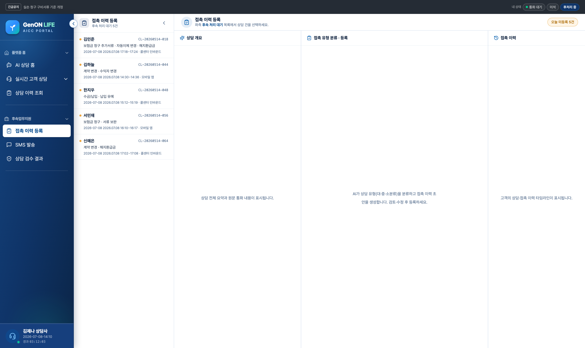

?task=contact · sms · audit-result 상담 종료 후 필수 후처리. **좌: 미처리 목록 / 우: 작업 패널**.

### 접촉 이력 등록 task=contact
- 오늘 미등록 건 → **상담 개요 · 접촉 유형 분류(대·중·소) · 접촉 이력** 3패널. AI가 유형별 초안 생성 → 검토·등록.

### SMS 발송 task=sms
- 미발송 건 → **문자 초안 어시스턴트**(상담 분석→조회→근거·작성→요약 4단계) → 근거 기반 초안 검토·발송.

### 상담 검수 결과 task=audit-result
- AI 검수 결과 목록(감지 우선) → **상담 대화 + 검수 결과** 2패널. 오안내·누락 확인 후 재안내/정정 조치.

---

<!-- _class: lead -->
# Ⅱ. 관리자 (Admin) 화면

---

## [관리자] ① AI 상담 홈 — 운영 대시보드

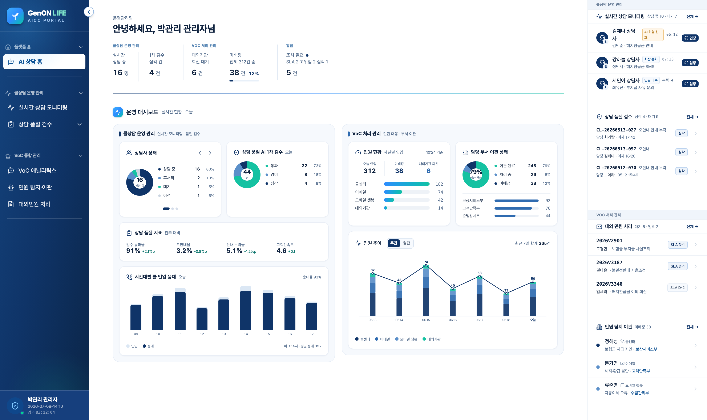

/main · admin 센터 전체를 한 화면에. 좌측 운영 대시보드 / 우측 4대 업무 큐.

### 콜상담 운영 관리
- **상담사 상태** 도넛(상담중 16·후처리·대기·이석) · **AI 1차 검수** 도넛(통과 32·경미 8·심각 4).
- 품질 지표(통과율 91%·오안내 3.2%·누락 5.1%·만족도 4.6) · **시간대별 콜 인입·응대**(피크 14시 64콜).

### VoC 처리 관리
- 채널별 인입(콜 182·이메일 74·챗봇 42·대외 14) · **부서 이관 상태** 도넛(완료 248/76%).

### 우측 · 4대 업무 큐
- **실시간 상담 모니터링 · 상담 품질 검수 · 대외 민원 처리 · 민원 탐지 이관** — 긴급건 상단, 클릭 시 상세 이동.

---

## [관리자] ② 실시간 상담 모니터링

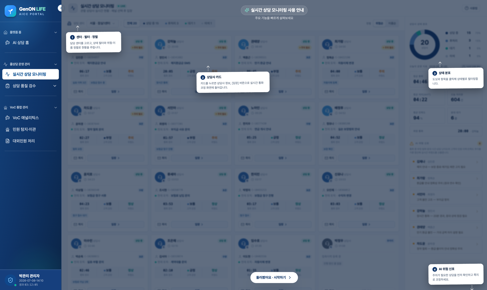

/realtime-monitoring 진행 중인 통화를 **실시간 청취·코칭**하며 품질을 관제.

### 모니터링 로비
- 상담사 20명 카드(상담중 16·후처리 2·대기 1·이석 1), 상태·고객·주제·진행시간·**AI 위험 신호**.
- 센터 필터 · 위험/이름 정렬 · 우측 KPI(평균 통화 4:18·오늘 처리 312건·만족도 94%).

### 모니터링 룸 (4분할)
- **실시간 STT** 청취 + AI 신호 배너.
- **실시간 코칭** — 예상 코칭 멘트 원클릭 전송(귓속말/전체).
- **상담지식 RAG** 검색 · **업무정보**(고객·제품·청구) 패널.

---

## [관리자] ③ 상담 품질 검수

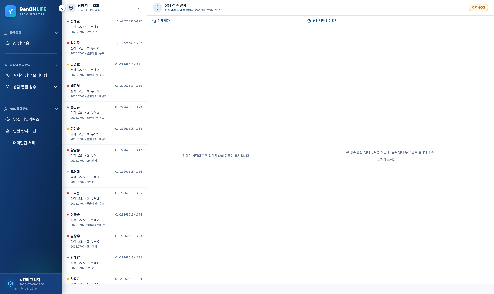

?task=audit-result **AI 1차 검수 + 관리자 휴먼 2차 검수** 통합. 좌 목록 / 우 상세(메일함형).

### 검수 결과 목록
- 상태 점(심각·경미·통과) + 고객·상담ID·문제 요약. 감지 9건 / 통과 32건.

### 검수 상세 (2열)
- **좌: 상담 대화** 원문(STT 보정 이력 포함).
- **우: 검수 결과** — AI 자동 판정(본인확인·안내 정확성·**오안내**·**업무 누락**) + 근거 약관 인용.

### 휴먼 2차 검수
- 관리자 판정·코멘트 + **후속 조치**(재안내 전화 / 정정 문자 / 접촉이력) → 상담사에게 이관, 완료 시 조치 이력 박제.

---

## [관리자] ④ VoC 애널리틱스 — Ⓐ 실시간 이슈 모니터링

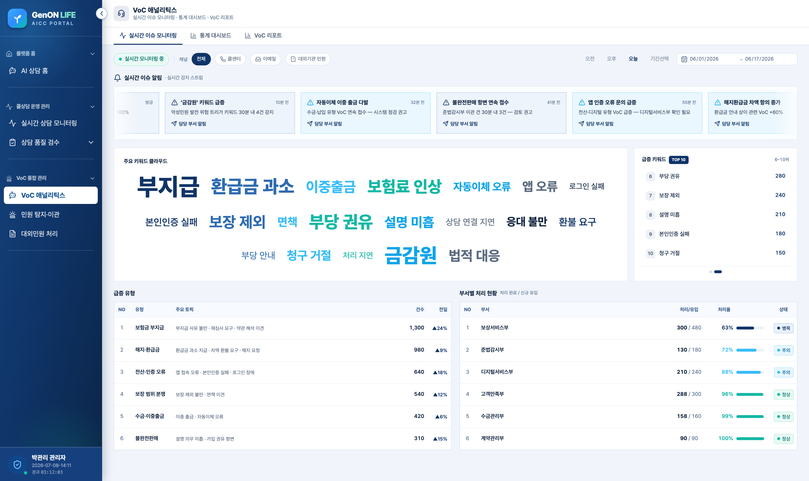

/voc-console · monitor 실시간 VoC 스트림에서 **위험 이슈를 조기 탐지**.

### 실시간 이슈 알림 (카루셀)
- "보험금 부지급 불만 급증 +180%", "'금감원' 키워드 급증", "자동이체 이중 출금 다발" 등.

### 급증 키워드·유형
- **급증 키워드 TOP 10**(5개씩 순환) · 키워드 클라우드.
- **급증 유형 테이블** — 유형·주요 토픽·건수·전일 대비(보험금 부지급 1,300건 +24% 등).

### 부서별 처리 현황
- 6개 부서 처리/유입 · 처리율 바 · 상태(병목·주의·정상).
- 상단 **채널·기간 필터**.

---

## [관리자] ④ VoC 애널리틱스 — Ⓑ 통계 대시보드

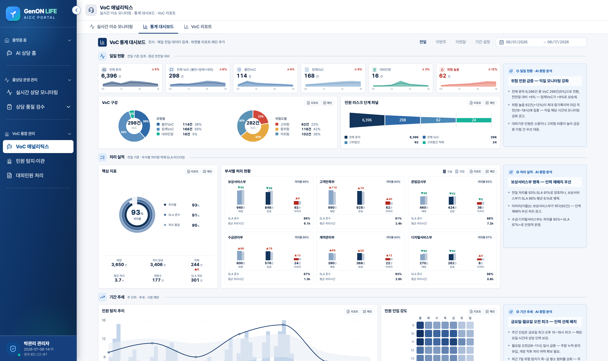

statsboard 전사 VoC를 **매일 전일 데이터**로 집계. 우측 **AI 종합 분석** 카드가 섹션별 인사이트 제공.

- **① 일일 현황** — KPI 6종 스파크라인(전체 문의 1,850·VoC 750·고위험 95) / VoC 구성 도넛(유형·위험도) / 리스크 단계 퍼널.
- **② 처리 실적** — 과녁 게이지(처리율 73%·SLA 88%·품질 85%) / 부서별 처리 현황(오늘 vs 전일).
- **③ 기간 추세** — 탐지 추이(일별+시간대) / 인입 강도 히트맵(요일×시간대).
- **④ 유형 분석** — 고객 프로파일 레이더(성별·나이대) / 유형 포지셔닝 버블 / 상품별 점유율 트리맵 / 원인 분류.
- **⑤ 인입 플로우** — 채널→유형→부서 생키(기본 접힘).

---

## [관리자] ④ VoC 애널리틱스 — Ⓒ VoC 리포트

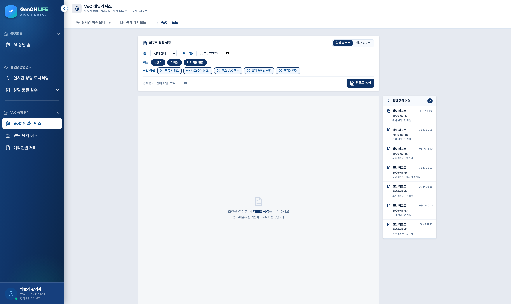

report 일일·월간 VoC 리포트를 **자동 생성·시각화·배포**.

### 리포트 생성 설정
- **일일 / 월간** 토글 · 보고 일자·기간 · 센터·채널 선택 · 포함 섹션 다중 선택.
- 우측 **생성 이력** 패널.

### 리포트 본문
- 접수 추이 라인 · 고객 경험 분포 도넛 · 금감원 민원 미니 바.
- 주요 VoC 접수 내용 테이블 · 경험별 현황 · (월간) VoC 현황 표·상위 유형·개선 사례.

### 내보내기
- **PDF · 엑셀 · 인쇄 · 공유**.

---

## [관리자] ⑤ 민원 탐지·이관 — VoC 통합 분석

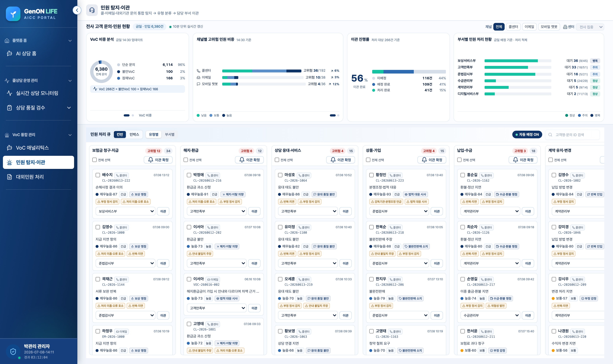

/complaint-detection 콜·이메일·챗봇 문의를 **단일 인입 큐로 통합**(탐지·평가 → 유형 분류 → 부서 이관). 금일 인입 2,450건.

### 현황 대시보드 (통합/실시간/부서별 탭)
- VoC 비중 ↔ 악성민원 발전 위험(슬라이드) · 채널별/유형별 고위험 비중 · **이관 진행률 73%** · 부서별 처리 현황.

### 인박스 테이블 (미배정 / 배정완료 / 처리완료)
- 위험도 점 · 고객·유형 · 접수일시 · 담당 부서 · 긴급도 · 상태. **부서 재배정·유형 변경** 가능.

### 상세 패널
- **처리 스테퍼**(이관 대기→배정→처리) · 감지 키워드·트리거 · AI 분류·부서 배정 · **VoC 등록**.

---

## [관리자] ⑥ 대외민원 처리

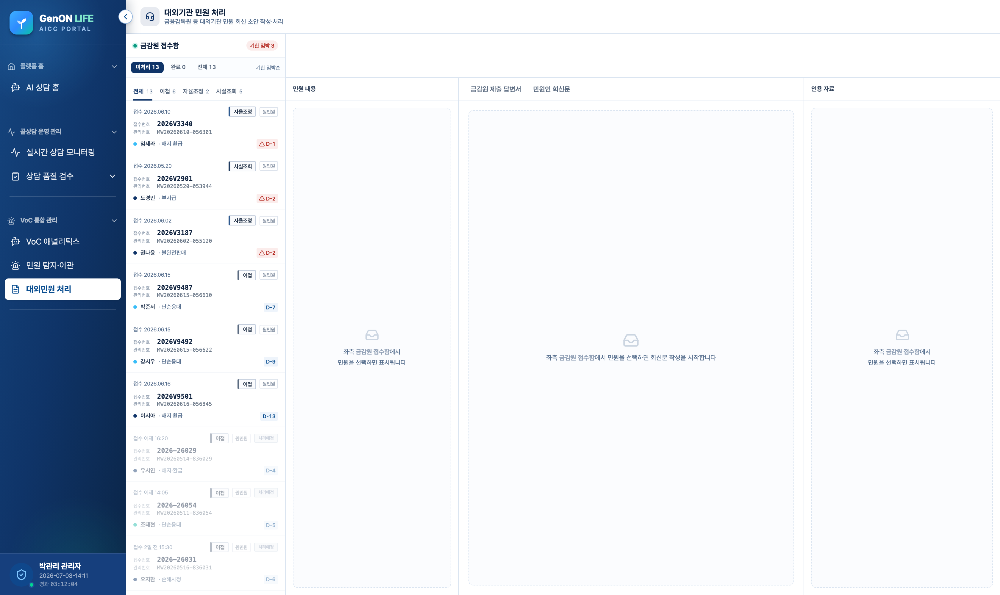

/external-complaint 금융감독원 등 대외기관 이첩 민원 **회신 초안 작성·처리**. 3단 레이아웃.

### 좌 · 금감원 접수함
- 미처리/완료/전체 · 처리 구분(이첩·자율조정·사실조회) · **D-Day 임박** 배지.

### 중앙 · 민원 내용 + 초안 작성
- **원천 시스템 조회**(계약원장·청구심사·손해사정·CRM) · 사실관계 타임라인.
- **금감원 회신 ↔ 민원인 회신** 탭 · 템플릿 선택 · **자동 초안 생성** · 검증 체크리스트(근거 인용·금지표현·기한).

### 우 · 인용 자료
- 사실 / 근거(약관·법령) / **사례**(유사 분쟁조정 판례) → 초안에 자동 첨부.

---

<!-- _class: lead -->
<!-- _paginate: false -->

# 감사합니다

제논라이프 AI 상담 포털 · 상담사 / 관리자 통합 지원